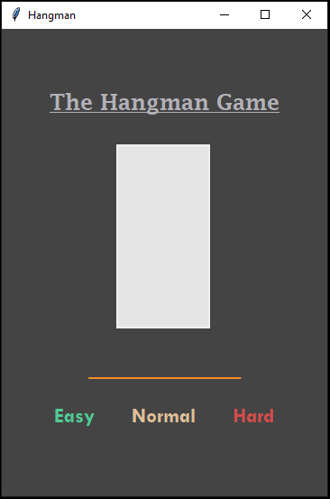
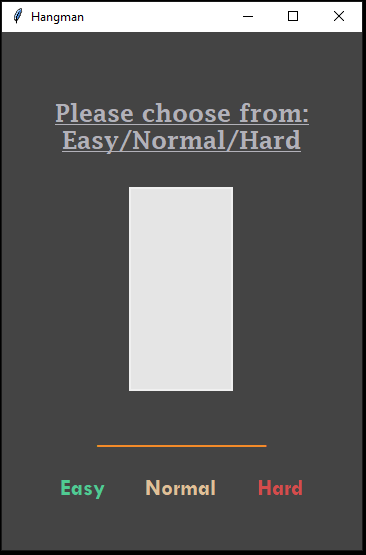
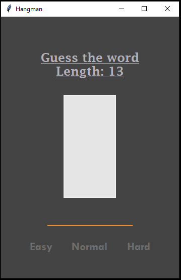
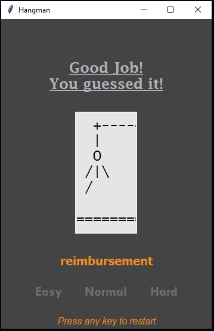
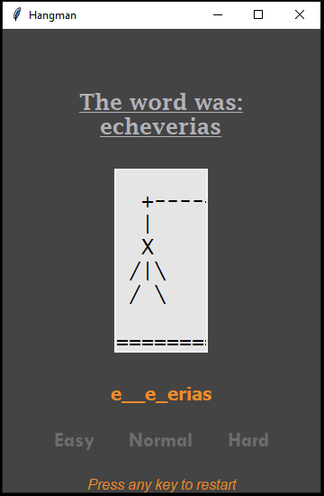

# Hangman
The Hangman game implemented using GUI

### Written in python 3.9 

## Installation on Windows:
* `git clone https://github.com/snehangsude/Hangman.git`
* `cd Hangman`
* `pip install -r requirements.txt`
* `python main.py`

## Installation on Linux and Unix like OS:
* `git clone https://github.com/snehangsude/Hangman.git`
* `cd Hangman`
* `pip install -r requirements.txt`
* `python3 main.py`

## Interface Images
* Inital screen

* Message if key is pressed without selecting Level

* Screen after selecting any of the three levels

* Successful guess

* Unsuccessful guess

